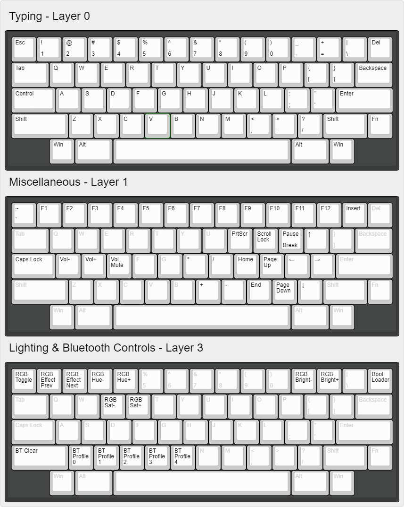

# Kawa ZMK Configuration

This repository is for the replacement wireless PCB for the RAMA Kara. Any questions, feel free to ask in the [RMI-KB discord server](https://discord.rmi-kb.com/).

## Default Layout

## Editing the keymap

1. Edit the `config/boards/arm/kawa/kawa.keymap` file to change your keymap.
- https://zmkfirmware.dev/docs/behaviors/key-press
- https://zmkfirmware.dev/docs/behaviors/layers
and pretty much everything in the "Behaviors" section, plus
- https://zmkfirmware.dev/docs/codes/

2. Head over to the Actions tab at the top of the repository.

3. Click on the latest workflow run.

- If you did your keymap correctly, there should be a green checkmark to the left.
- Click on the relevant firmware file to download. Unzip it somewhere too.

4. Plug the USB connector in, and double press the reset button twice quickly (Has to be <500 ms apart).

- Drag and drop the UF2 file you unzipped to the mass storage device that appeared.
- I think it's named NRF52BOOT or something? Whatever the name, there should be a UF2 file inside. Don't delete or anything, just drag and drop the new `kawa` firmware file to the mass storage device.